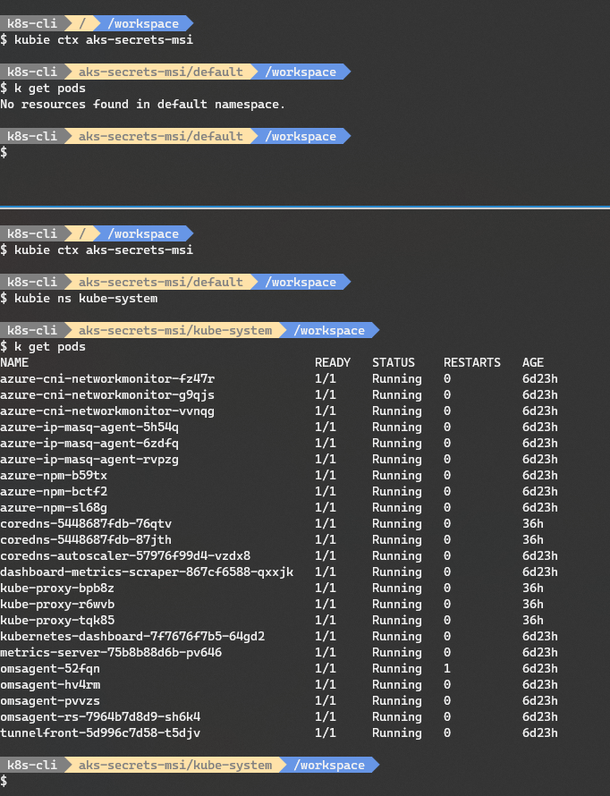

# Kubernetes CLI Toolset

Provides the following [Kubernetes](https://kubernetes.io/) cli toolset:

- kubectl **1.18.1** (with command completion)
- kubie **0.8.3** (with command completion)
- linkerd **stable-2.7.1** (with command completion)
- istioctl **1.5.1** (with command completion)
- helm **3.2.2** (with command completion)

And the following utilities/tools:

- curl
- git
- jq
- less
- vim

Leverages kube-ps1 **0.7.0** to provide the current Kubernetes context and namespace on the bash prompt. The bash prompt works well with the [Nerd Font patched Cascadia Code](https://github.com/ryanoasis/nerd-fonts/tree/master/patched-fonts/CascadiaCode) font.



## Toolset

### kubectl

[Kubernetes](https://kubernetes.io/docs/concepts/overview/what-is-kubernetes/) is an open-source platform for automating deployment, scaling, and operations of application containers across clusters of hosts, providing container-centric infrastructure. Kubernetes is:

- **Portable** - public, private, hybrid, multi-cloud
- **Extensible** - modular, pluggable, hookable, composable
- **Self-healing** - auto-placement, auto-restart, auto-replication, auto-scaling

> [kubectl](https://kubernetes.io/docs/user-guide/kubectl-overview/) is a command line utility for running [commands](https://kubernetes.io/docs/user-guide/kubectl/v1.7/) against Kubernetes clusters. kubectl is configured with [command completion](https://kubernetes.io/docs/tasks/tools/install-kubectl/#on-linux-using-bash).

### kubie

[kubie](https://github.com/sbstp/kubie) is an alternative to **kubectx**, **kubens** and the **k on** prompt modification script. It offers context switching, namespace switching and prompt modification in a way that makes each shell independent from others. It also has support for split configuration files, meaning it can load Kubernetes contexts from multiple files. You can configure the paths where kubie will look for contexts.

A sample `kubie.yaml` file is included in this repo. Place this file in your `~/.kube` folder.

### linkerd

[Linkerd](https://linkerd.io/2/overview/) is a service mesh for Kubernetes and other frameworks. It makes running services easier and safer by giving you runtime debugging, observability, reliability, and security—all without requiring any changes to your code.

> The [linkerd](https://linkerd.io/2/reference/cli/) CLI is the primary way to interact with Linkerd. It can install the control plane to your cluster, add the proxy to your service and provide detailed metrics for how your service is performing.

### istioctl

[Istio](https://istio.io) is an open platform that provides a uniform way to connect, manage, and secure microservices. Istio supports managing traffic flows between microservices, enforcing access policies, and aggregating telemetry data, all without requiring changes to the microservice code. Istio gives you:

> [istioctl](https://istio.io/docs/reference/commands/istioctl.html) is a command line utility to create, list, modify, and delete configuration resources in the [Istio](https://istio.io/) system.

### helm

[Helm](https://docs.helm.sh/) is the package manager for Kubernetes. It is a tool that streamlines installing and managing Kubernetes applications. Think of it like apt/yum/homebrew for Kubernetes.

> [helm](https://github.com/kubernetes/helm) is a tool for managing Helm Charts. Helm Charts are packages of pre-configured Kubernetes resources. Only the helm client is installed. You will need to install the tiller component into your Kubernetes cluster using `helm init`.

### kube-ps1

[kube-ps1](https://github.com/jonmosco/kube-ps1) is a script that lets you add the current Kubernetes context and namespace configured on kubectl to your bash/zsh prompt strings (i.e. the `$PS1`). It has been leveraged in this image to provide a customised prompt that provides information about the Kubernetes cluster that `kubectl` is currently targeting.

## Docker image

The Docker image is built on top of the `Ubuntu 19.10` base image to provide a full weight environment. It is available on DockerHub as:

- [paulbouwer/k8s-cli-toolset:0.15](https://hub.docker.com/r/paulbouwer/k8s-cli-toolset/)

### Run

Run the image as follows. Ensure that you mount your ~/.kube and ~/.helm folders on your host into the Docker container for the utilities to operate correctly.

Windows
```
PS> docker run -it --rm -v ${HOME}/.kube:/root/.kube -v ${HOME}/.helm:/root/.helm paulbouwer/k8s-cli-toolset:0.15
```

Linux/MacOS
```
$ docker run -it --rm -v ${HOME}/.kube:/root/.kube -v ${HOME}/.helm:/root/.helm paulbouwer/k8s-cli-toolset:0.15
```

### Build

If you'd like to build the image yourself, then you can do so as follows. The `build-arg` parameters provide values to the Docker image labels which follow the [OCI Image Spec Annotations](https://github.com/opencontainers/image-spec/blob/master/annotations.md) convention.

Powershell
```
PS> docker build --no-cache --build-arg IMAGE_VERSION="0.15" --build-arg IMAGE_CREATE_DATE="$(Get-Date((Get-Date).ToUniversalTime()) -UFormat '%Y-%m-%dT%H:%M:%SZ')" --build-arg IMAGE_SOURCE_REVISION="$(git rev-parse HEAD)" -f Dockerfile -t "k8s-cli-toolset:0.15" .
```

Bash
```
$ docker build --no-cache --build-arg IMAGE_VERSION="0.15" --build-arg IMAGE_CREATE_DATE="`date -u +"%Y-%m-%dT%H:%M:%SZ"`" --build-arg IMAGE_SOURCE_REVISION="`git rev-parse HEAD`" -f Dockerfile -t "k8s-cli-toolset:0.15" .
```